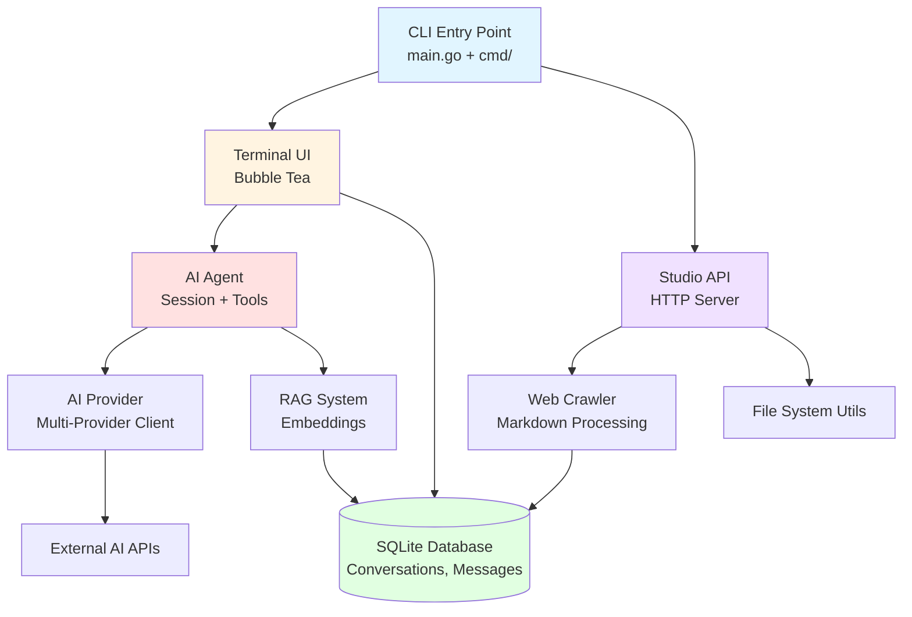
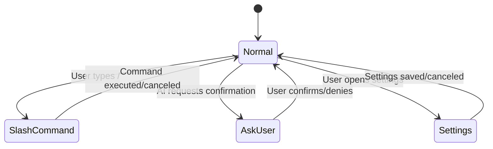

# Stick Project Breakdown

## Executive Summary

**Stick** is an AI-powered development assistant built with Go that transforms from a simple Git utility into a sophisticated terminal-based AI agent. It combines a Terminal User Interface (TUI), database persistence, RAG (Retrieval-Augmented Generation), and a web API to provide an interactive development experience.

**Repository**: github.com/tesh254/stick  
**Language**: Go 1.24.3  
**License**: MIT  
**Author**: Erick Wachira (tesh254)

---

## 🎯 Project Purpose

### Original Scope
A command-line tool for working with Git repositories, providing useful information about commits, branches, and versions.

### Current Scope
An AI-enhanced development assistant featuring:
- Interactive Terminal UI with AI chat capabilities
- Session-based agent architecture with tool support
- Database-backed conversation persistence
- RAG for context-aware responses
- Web API (Studio) for configuration and interactions
- User confirmation workflows (`askUser` mode)
- Multi-provider AI support (BYOK - Bring Your Own Key)

---

## 🏗️ Architecture Overview

### High-Level Architecture



### Component Layers

| Layer | Components | Purpose |
|-------|-----------|---------|
| **Entry** | `main.go`, `cmd/` | CLI command routing and initialization |
| **Interface** | `internal/tui/` | Interactive terminal interface (Bubble Tea) |
| **AI Core** | `internal/agent/`, `internal/prompts/` | AI agent logic, session management, prompts |
| **Providers** | `internal/provider/` | Multi-provider AI client abstraction |
| **Intelligence** | `internal/rag/` | RAG embeddings for enhanced queries |
| **Data** | `internal/db/` | SQLite repositories for persistence |
| **Functions** | `internal/functions/` | Function registry and parser |
| **API** | `internal/studio/` | HTTP server with routes and handlers |
| **Utilities** | `internal/utils/`, `internal/fs/`, `internal/events/` | Helper functions, file system, event emitter |
| **Content** | `internal/crawl/` | Web crawling and markdown processing |

---

## 📂 Project Structure

```
stick/
├── main.go                      # Entry point
├── cmd/                         # Cobra commands
│   ├── root.go                  # Root command (starts session)
│   ├── db.go                    # Database commands
│   ├── setup.go                 # Setup wizard
│   ├── studio.go                # Studio server command
│   ├── update.go                # Self-update functionality
│   └── version.go               # Version information
│
├── internal/
│   ├── tui/                     # Terminal UI (21 files)
│   │   ├── model.go             # Bubble Tea model
│   │   ├── messages.go          # Message handling and rendering
│   │   ├── ask_user.go          # Yes/No confirmation component
│   │   ├── initial.go           # Initial state setup
│   │   ├── settings.go          # Settings modal
│   │   ├── ui.go                # UI composition
│   │   ├── update_view.go       # Update/View logic
│   │   ├── storage_sync.go      # Database synchronization
│   │   ├── message_pipeline.go  # Message processing pipeline
│   │   └── ...                  # Tests, styles, renders
│   │
│   ├── agent/                   # AI agent logic
│   │   ├── session.go           # Session management
│   │   ├── types.go             # Agent types
│   │   └── tools/               # Agent tools
│   │
│   ├── db/                      # Database layer (9 files)
│   │   ├── db.go                # Database initialization
│   │   ├── migrations.go        # Schema migrations
│   │   ├── types.go             # Database types
│   │   ├── repository.go        # Base repository
│   │   ├── conversation_repository.go
│   │   ├── message_repository.go
│   │   ├── call_repository.go   # Function call events
│   │   └── usage_repository.go  # Usage tracking
│   │
│   ├── provider/                # AI provider abstraction
│   ├── prompts/                 # System and user prompts
│   ├── rag/                     # RAG embeddings
│   ├── functions/               # Function registry
│   ├── studio/                  # Web API server
│   ├── crawl/                   # Web crawler
│   ├── handlers/                # CLI handlers
│   ├── events/                  # Event emitter
│   ├── fs/                      # File system utilities
│   ├── utils/                   # Misc utilities
│   └── version/                 # Version info
│
├── docs/                        # Documentation
├── context/                     # Context files
├── install.sh                   # Installation script
├── uninstall.sh                 # Uninstallation script
├── specification.md             # Project specification
├── stick.json                   # Configuration file
├── go.mod                       # Go dependencies
└── go.sum                       # Dependency checksums
```

---

## 🔧 Technology Stack

### Core Technologies
- **Language**: Go 1.24.3
- **CLI Framework**: Cobra (command-line interface)
- **Configuration**: Viper (config management)
- **Database**: SQLite via `modernc.org/sqlite` + `libsql-client-go`

### UI & Terminal
- **TUI Framework**: Bubble Tea (`charmbracelet/bubbletea`)
- **Styling**: Lipgloss (`charmbracelet/lipgloss`)
- **Components**: Bubbles (`charmbracelet/bubbles`)

### AI & Processing
- **HTML Processing**: `html-to-markdown/v2`
- **Version**: Semantic versioning (`Masterminds/semver/v3`)
- **UUID**: UUIDv7 (`dombox/uuidv7`)

### Web & API
- **HTTP Framework**: Fiber (`gofiber/fiber/v2`)
- **WebSocket**: Coder WebSocket (`coder/websocket`)

---

## 🗂️ Key Components Deep Dive

### 1. Terminal UI (`internal/tui/`)

The TUI is built with Bubble Tea and provides:

**Core Files**:
- `model.go` - Main Bubble Tea model with state management
- `messages.go` - Message rendering and display logic (21KB, complex)
- `ask_user.go` - Yes/No confirmation list component
- `settings.go` - Settings modal for configuration
- `message_pipeline.go` - Message processing pipeline

**Features**:
- Viewport for message display
- Textarea for user input
- Slash command modal (`/functions`, `/help`, `/reload`, `/replay_last`)
- Mode switching (normal, askUser, settings)
- Message persistence to database
- Command history

**UI Modes**:


### 2. Database Layer (`internal/db/`)

SQLite-based persistence with repository pattern:

**Entities**:
- **Conversation**: Chat sessions with metadata
- **Message**: Individual messages (user/assistant)
- **CallEvent**: Function call tracking
- **Usage**: Token usage and costs

**Repositories**:
```go
type Repository interface {
    Conversations() *ConversationRepository
    Messages() *MessageRepository
    Calls() *CallRepository
    Usage() *UsageRepository
}
```

**Schema** (from `migrations.go`):
- `conversations`: id, created_at, updated_at, title, metadata
- `messages`: id, conversation_id, role, content, created_at
- `call_events`: id, conversation_id, function_name, args, result, created_at
- `usage`: id, conversation_id, tokens, cost, created_at

### 3. AI Agent (`internal/agent/`)

Session-based agent architecture:

**Components**:
- `session.go` - Agent session lifecycle
- `types.go` - Agent types and interfaces
- `tools/` - Agent tools (function calling)

**Workflow**:
1. User sends message via TUI
2. Message added to conversation context
3. Agent processes with provider (AI API)
4. Tools executed if needed
5. Response rendered in TUI
6. All events persisted to DB

### 4. AI Provider (`internal/provider/`)

Multi-provider abstraction supporting BYOK (Bring Your Own Key):

**Features**:
- Provider adapter pattern
- Tool/function calling support
- Streaming responses
- Error handling and retries

**Supported Providers**: (Based on configuration)
- OpenAI
- Anthropic
- Google Gemini
- Other compatible providers

### 5. RAG System (`internal/rag/`)

Retrieval-Augmented Generation for context-aware responses:

**Components**:
- Embeddings generation
- Vector search
- Context augmentation

**Use Cases**:
- Code search within repositories
- Documentation retrieval
- Context-aware completions

### 6. Functions Registry (`internal/functions/`)

Function/tool management system:

**Features**:
- Function registration with min/max arguments
- Function parser for user inputs
- Validation and execution
- Result formatting

### 7. Studio API (`internal/studio/`)

HTTP server for external integrations:

**Routes & Handlers**:
- Configuration endpoints
- Conversation management
- WebSocket connections
- Health checks

**Use Cases**:
- Web-based UI (future)
- External tool integrations
- Remote configuration

### 8. Web Crawler (`internal/crawl/`)

Web content extraction and processing:

**Features**:
- HTML to Markdown conversion
- Content cleaning
- Metadata extraction
- RAG integration

---

## 📋 Available Commands

### Root Command
```bash
# Start interactive session
./stick

# Or use alias
./stk
```

### Subcommands

| Command | Description |
|---------|-------------|
| `stick db` | Database management commands |
| `stick setup` | Run setup wizard |
| `stick studio` | Start Studio API server |
| `stick update` | Update stick to latest version |
| `stick version` | Show version information |

### TUI Slash Commands

| Command | Description |
|---------|-------------|
| `/functions` | List available functions |
| `/help` | Show help information |
| `/reload` | Reload conversation |
| `/replay_last` | Replay last message |

---

## 🔄 Development Workflow

### Recent Development (Per CHANGELOG)

#### Unreleased
- ✅ Session-based agent architecture
- ✅ Agent init command
- ✅ TUI integration with chat completion
- ✅ Chat TUI implementation
- ✅ Additional tools support
- ✅ Refactored agent architecture
- ✅ Fixed minor bugs in textarea

#### Version 1.0.2
- ✅ Module configuration for `go get`
- ✅ Provider adapter for BYOK support
- ✅ Git diff parser
- ✅ Agent configuration
- ✅ Tests
- ✅ Refactored provider toggling
- ✅ Updated function calling to use coding model

### Current Status (Per specification.md)

**Completed Milestones**:
- ✅ Initial setup and core functionality
- ✅ Database integration with SQLite
- ✅ Function registry and parser
- ✅ TUI with Bubble Tea
- ✅ AI agent integration
- ✅ RAG for embeddings
- ✅ Studio API server
- ✅ `askUser` mode component design

**In Progress**:
- 🔄 Full integration of `askUser` mode into TUI
- 🔄 AI agent tool call triggering for bash confirmations
- 🔄 Testing of `askUser` implementation

---

## 🐛 Known Issues

From `specification.md`:

1. **Message Persistence**: Potential inconsistencies during high-volume interactions (partially addressed with non-blocking writes)
2. **Function Parsing**: Limited error handling for complex inputs
3. **TUI Resizing**: Modal heights may not adjust perfectly on resize
4. **RAG Testing**: No comprehensive testing in production scenarios

---

## 📝 Outstanding Tasks

### Short-term (1-2 weeks)
- [ ] Complete `askUser` mode integration and testing
- [ ] Hook up `askUser` to AI agent tool calls (bash confirmations)
- [ ] Add unit tests for TUI components
- [ ] Add unit tests for AI agent tools

### Medium-term (1-2 months)
- [ ] Expand RAG with better embedding models
- [ ] Enhance Studio API with more endpoints
- [ ] Add authentication to Studio API
- [ ] Optimize database with indexing
- [ ] Documentation for sub-modules (agent, crawl)

### Long-term (3+ months)
- [ ] Integrate more AI providers
- [ ] Advanced prompting techniques
- [ ] Web-based UI complementing TUI
- [ ] Improved contributing guidelines
- [ ] Community examples and tutorials

---

## 🚀 Development Priorities

### Immediate Focus
1. **`askUser` Mode**: Complete integration for user confirmations
2. **Testing**: Comprehensive test coverage for TUI and agent
3. **Documentation**: Enhance inline and module docs

### Strategic Priorities
1. **RAG Enhancement**: Better embeddings and retrieval
2. **API Security**: Authentication and authorization
3. **Performance**: Database optimization and caching
4. **UI Options**: Web interface alongside TUI

---

## 📦 Installation & Setup

### Prerequisites
- Go 1.24 or higher

### Installation
```bash
# Clone repository
git clone https://github.com/tesh254/stick.git
cd stick

# Build application
go build .

# Or use install script
./install.sh
```

### Configuration
Configuration file: `$HOME/.stick.yaml` or via `--config` flag

---

## 🧪 Testing

### Run Tests
```bash
# All tests
go test ./...

# With coverage
go test -cover ./...

# Generate coverage report
go test -coverprofile=coverage.out ./...
```

### Test Files
- `internal/tui/messages_test.go`
- `internal/tui/messages_pipeline_test.go`
- `internal/tui/messages_volume_test.go`
- `internal/tui/ui_test.go`
- `internal/db/db_test.go`

---

## 🤝 Contributing

See [CONTRIBUTING.md](../CONTRIBUTING.md) for guidelines:

- Use present tense in commits
- Format with `gofmt`
- Follow [Effective Go](https://golang.org/doc/effective_go.html)
- Open issues for bugs/features
- Fork and create feature branches

---

## 📄 License

MIT License - See [LICENSE](../LICENSE)

---

## 🔗 Key Files Reference

| File | Purpose | Complexity |
|------|---------|------------|
| [main.go](../main.go) | Entry point | Simple |
| [cmd/root.go](../cmd/root.go) | Root command setup | Medium |
| [specification.md](../specification.md) | Project spec | High |
| [internal/tui/messages.go](../internal/tui/messages.go) | Message rendering | High |
| [internal/tui/model.go](../internal/tui/model.go) | TUI state model | Medium |
| [internal/db/db.go](../internal/db/db.go) | Database setup | High |
| [go.mod](../go.mod) | Dependencies | Reference |

---

## 📊 Project Metrics

- **Total components**: 14 major internal modules
- **TUI files**: 21 files in `internal/tui/`
- **Database entities**: 4 (Conversation, Message, CallEvent, Usage)
- **Commands**: 6 CLI commands + 4 TUI slash commands
- **Go version**: 1.24.3
- **Main dependencies**: 18 direct, 50+ indirect

---

## 🎯 Core Value Proposition

Stick transforms Git-focused development into an **AI-augmented workflow** where:
- Natural language interfaces replace complex CLI syntax
- Conversations are persisted for context continuity
- AI assistance is grounded with RAG for accuracy
- User confirmations ensure safe command execution
- Multi-provider support avoids vendor lock-in

**Vision**: A development assistant that understands your codebase, version history, and workflow preferences to provide intelligent, context-aware assistance directly in the terminal.
